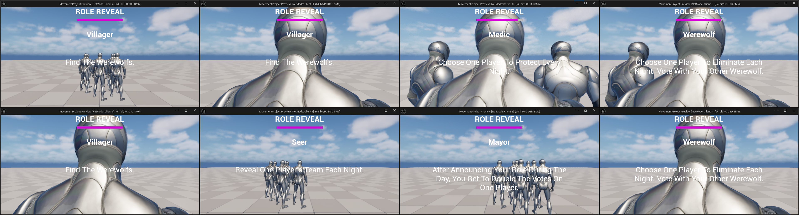
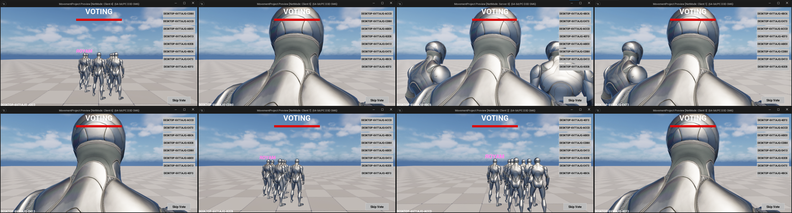

# Hidden Fangs

A **Unreal Engine 5 + C++** networked multiplayer social deduction game inspired by the classic party game Werewolf, built around server-authoritative gameplay, role-based abilities, and real-time replicated game state across multiple clients.

This project was built as a fully networked multiplayer experience where players are secretly assigned roles, take actions during a Night phase, discuss and vote during a Day phase, and work to uncover or protect their team until one side wins.

---

## Project Overview
**Hidden Fangs** is a phase-based social deduction game where players are secretly assigned one of several roles — Werewolf, Medic, Seer, Villager, or Mayor — each with distinct abilities and win conditions. Werewolves work together to eliminate Villagers each night, while Villagers use deduction, discussion, and voting to identify and eliminate the Werewolves before they're outnumbered.

The project includes a complete multiplayer gameplay loop, from lobby-based matchmaking through role assignment, night actions, day voting, and win-condition resolution — all synchronized live across every connected client.

The project showcases:

- Server-authoritative networked gameplay programming in Unreal Engine 5 using C++
- Replicated game state management using RepNotify, Server RPCs, and NetMulticast functions
- Role-based ability systems driven by data tables
- Real-time UI built with UMG, bound to live replicated data via delegates
- A full phase-based game state machine with server-controlled timers

---

## Gameplay Summary
Players join a lobby and wait for the required player count before roles are secretly assigned. Once assigned, each player sees their role and, if applicable, their partner (Werewolves are paired and can see each other's identity).

Each round cycles through distinct phases: Role Reveal, Night, Day, and Voting. During the Night phase, Werewolves choose a target to eliminate, the Medic chooses a player to protect, and the Seer chooses a player to investigate. During the Day and Voting phases, players discuss and vote to eliminate a suspected Werewolf.

The Gameplay Loop Features:

1. Secret, randomized role assignment each match
2. Coordinated Werewolf night-kill voting with partner visibility
3. Medic protection with limited self-protection uses
4. Seer investigation revealing a target's team allegiance
5. Public day-phase voting with live vote-count display
6. Automatic win-condition checking after every phase

---

## Controls

| Action | Input |
|---|---|
| Select Night Target | **Left Mouse Button** (on player list) |
| Select Day Vote Target | **Left Mouse Button** (on player list) |

### Notes
- Werewolves cannot target themselves or their partner during Night actions (Medic and Seer are exempt from this restriction for their own abilities).
- Medic self-protection is limited to a fixed number of uses per game.
- The Seer's investigation ability is limited to a fixed number of uses per game.
- Voting ties result in no elimination for that round.
- All game logic — phase transitions, role assignment, action validation, and win conditions — is resolved on the server; clients only submit requests.

---

## Core Features

### Role System
- Data-driven role definitions (team, description, night-action eligibility, ability limits) via Unreal DataTables
- Five distinct roles: Werewolf, Medic, Seer, Villager, Mayor
- Randomized role pool shuffling and assignment per match

### Night Action System
- Server-validated target submission with self/partner-targeting restrictions
- Werewolf partner-vote coordination with live "partner's choice" display
- Medic protection resolution, including self-protection limits
- Seer investigation revealing a target's team

### Day Voting System
- Public voting with real-time vote-count display on each player entry
- Tie detection preventing incorrect eliminations
- Automatic elimination of the player with the most votes

### Win Condition System
- Live tracking of remaining players per team
- Automatic win evaluation after every phase
- Server multicast notification of match results to all clients

### Multiplayer & Replication
- Server-authoritative game state machine (Lobby → Role Reveal → Night → Day → Voting)
- Replicated player state (role, alive status, votes, targets) synchronized across all clients
- Server and Client RPCs for player actions and role/result delivery
- Manual RepNotify handling to keep listen-server hosts in sync with remote clients

### UI
- UMG widgets driven entirely by delegate broadcasts rather than polling, for responsive live updates
- Dynamic player-list widgets generated at runtime for targeting and voting
- Role reveal, partner reveal, vote-error, and elimination notification widgets

---

## Scene / Flow Overview

The game includes a complete flow rather than a single isolated test level:

- **Lobby** for players to ready up before the match begins
- **Role Reveal phase** displaying each player's secret role
- **Night phase** for role-based ability submissions
- **Day phase** for open discussion
- **Voting phase** for public elimination voting
- **Win-condition resolution** and match-end notification

---

## Tech Stack

- **Engine:** Unreal Engine 5
- **Language:** C++ (with supporting UMG/Blueprint widgets)
- **Networking:** Unreal Engine's built-in replication system (RPCs, RepNotify, NetMulticast)
- **Project Type:** Multiplayer Social Deduction Game
